

# SonnetPulse

### **The Modern, Zero-Setup, Privacy-First Offline LaTeX Studio**

_Write beautiful books, academic papers, resumes, and reports offline with instant compilation._

[-success?style=for-the-badge&logo=latex>)](https://github.com/ntxmproducts/sonnet-pulse/releases/)

 

[📥 **Download Latest Release**](https://github.com/ntxmproducts/sonnet-pulse/releases/) &nbsp;•&nbsp; [🖼️ **App Gallery**](#️-app-gallery) &nbsp;•&nbsp; [📚 **Built-in Templates**](#-built-in-templates) &nbsp;•&nbsp; [✨ **Features**](#-features)

 

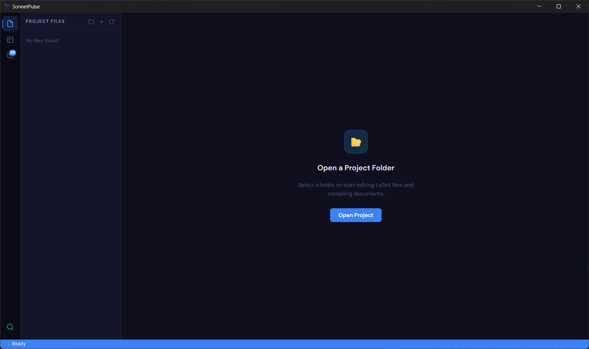

---

## 💡 Why SonnetPulse?

- ⚡ **Zero Setup & 100% Offline**: Includes the embedded Tectonic compiler engine natively. No 5GB TeX Live installation or cloud setup needed.
- 🎨 **Modern Visual Studio**: Multi-tab Monaco editor with syntax highlighting, live side-by-side PDF preview, and real-time workspace file watcher.
- 🔒 **100% Local & Private**: Your code, documents, and data remain strictly on your machine.

---

## 🖼️ App Gallery

 

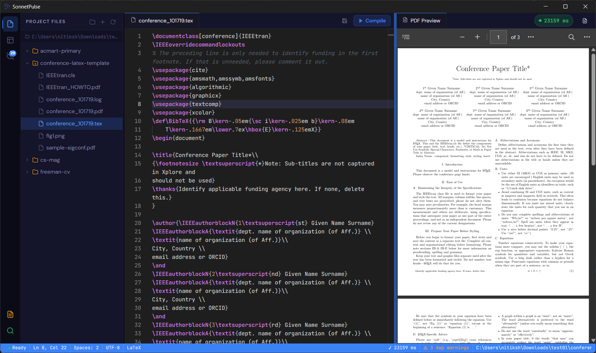

 

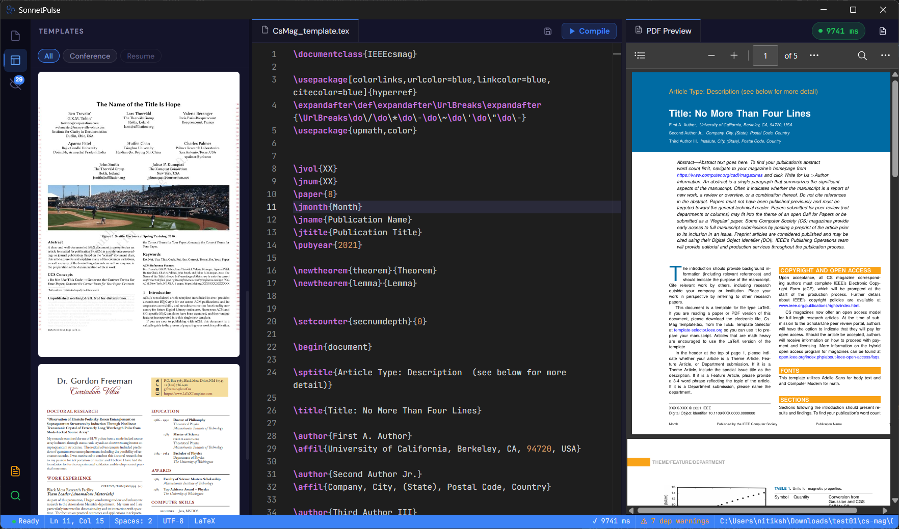

 

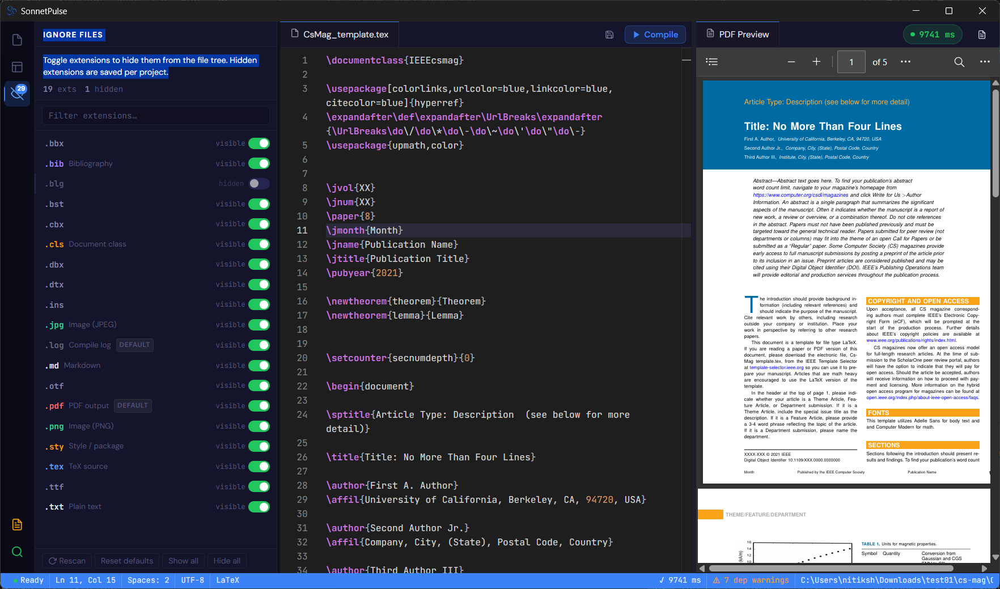

 

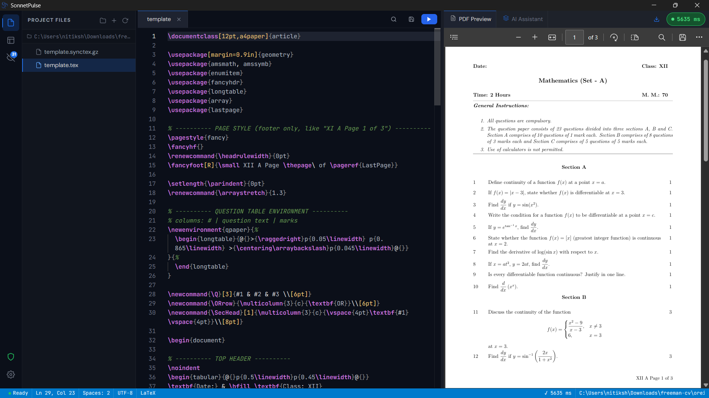

 

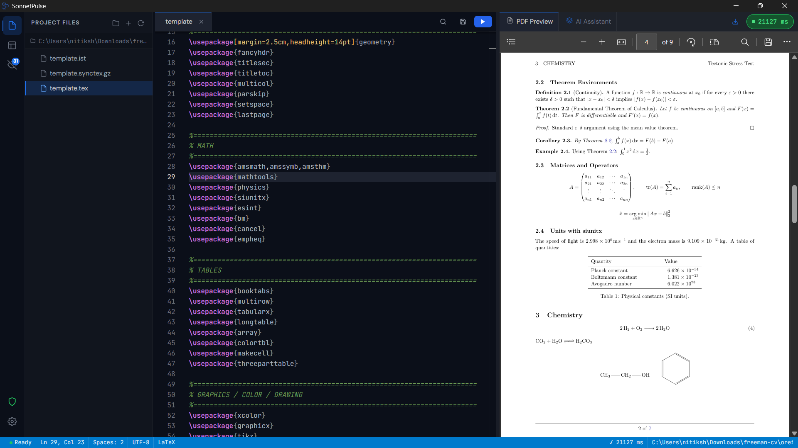

 

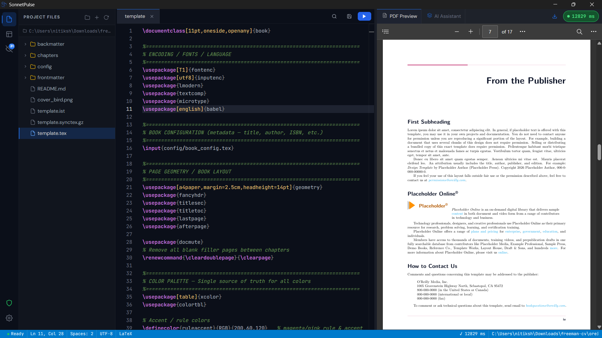

---

## 📚 Built-in Templates

SonnetPulse comes with pre-packaged templates ready to use:

<table>
<tr>
<td width="33%" align="center">
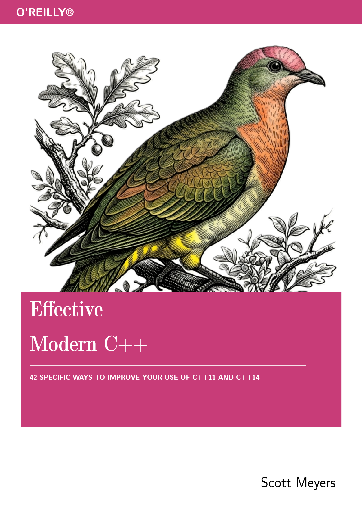 
<b>O'Reilly Book Template</b> 
Full textbook layout with chapter setup, code blocks & callouts
</td>
<td width="33%" align="center">
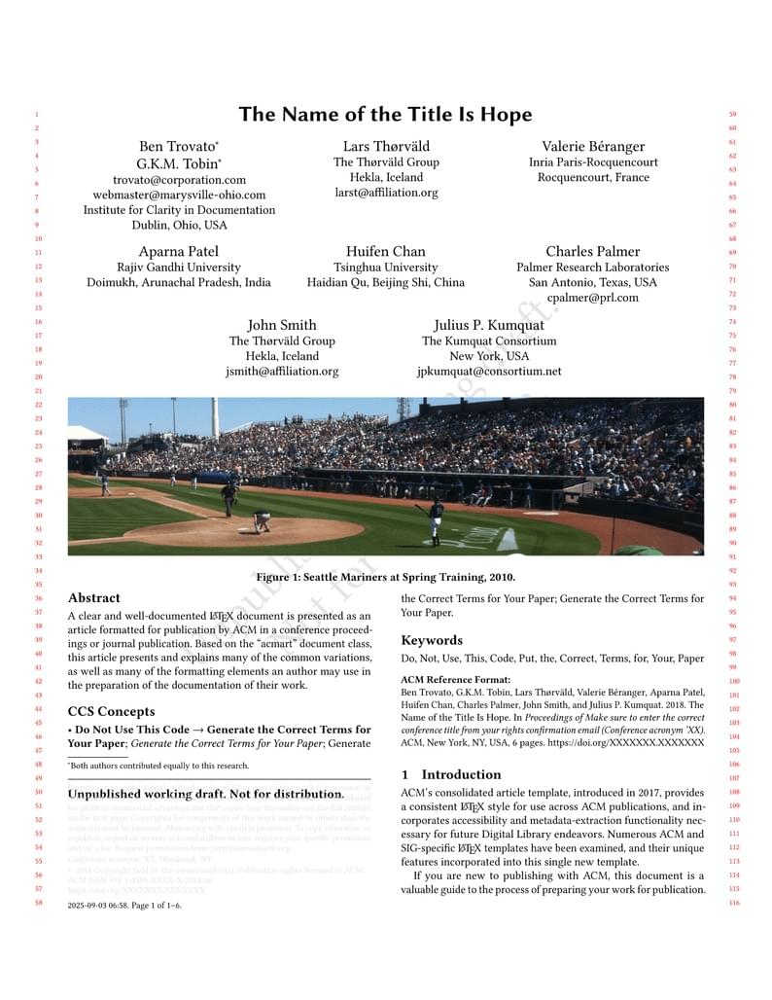 
<b>ACM Conference Paper</b> 
Official ACM SIGCONF & journal format
</td>
<td width="33%" align="center">
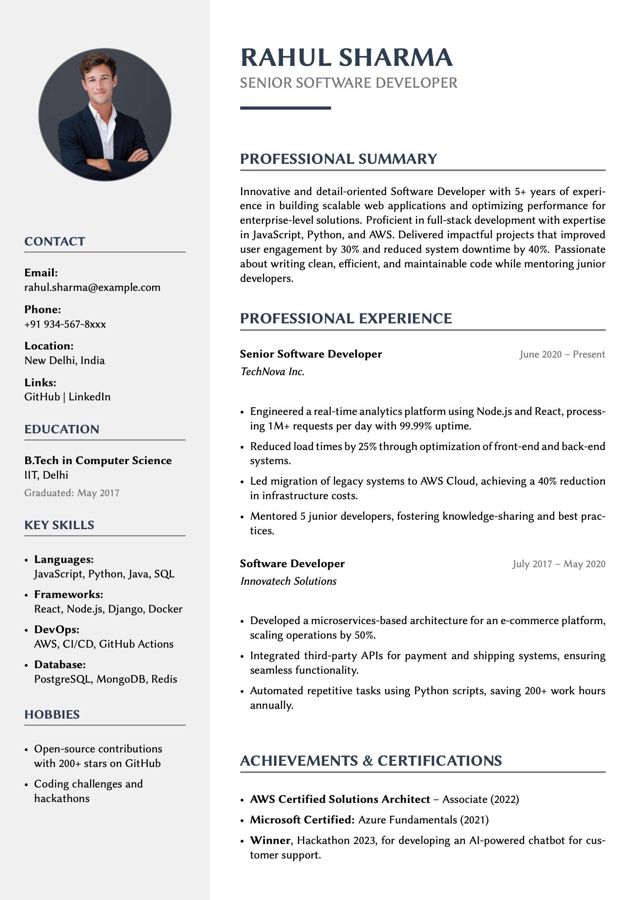 
<b>Apex Resume</b> 
Clean, modern single-page resume
</td>
</tr>
<tr>
<td width="33%" align="center">
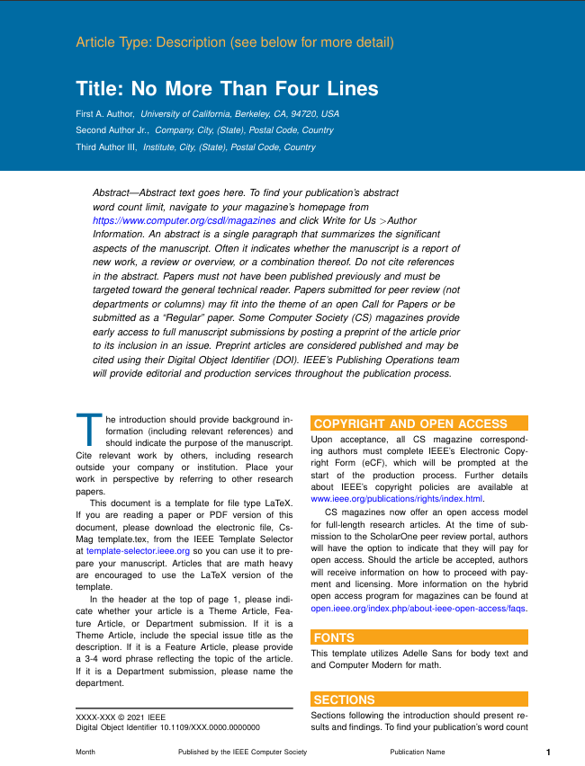 
<b>CS Magazine Layout</b> 
Multi-column magazine style layout
</td>
<td width="33%" align="center">
 
<b>Freeman CV</b> 
Academic curriculum vitae format
</td>
<td width="33%" align="center">
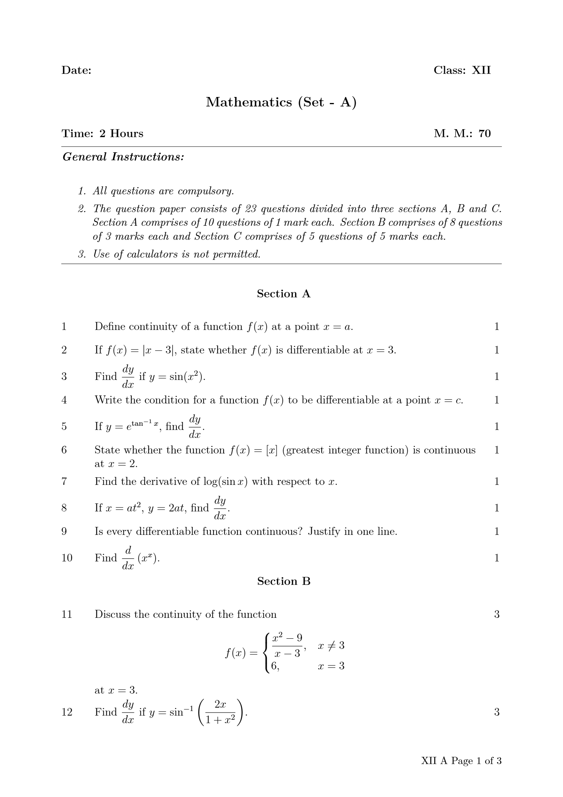 
<b>Maths Exam Paper</b> 
Structured exam & formula layout
</td>
</tr>
</table>

---

## ✨ Features

- ⚡ **Embedded Tectonic Engine**: Fast, self-contained LaTeX compilation without separate installs.
- 📝 **Monaco Code Editor**: Professional editor with syntax highlighting, find & replace, and dark mode.
- 👁️ **Live PDF Preview**: High-resolution vector PDF rendering with zoom, auto-recompile, and export.
- 📁 **Real-Time Directory Watcher**: Automatically syncs external file creations, edits, and deletions.
- ⚙️ **Smart Ignore List**: Filter intermediate build files out of your workspace view.
- 🔍 **Clear Error Diagnostics**: Readable error messages for fast debugging.

---

## 📊 Speed & Privacy Comparison

| Feature / Metric      |  **SonnetPulse**   |    Overleaf (Cloud)     | Traditional TeX Live |
| :-------------------- | :----------------: | :---------------------: | :------------------: |
| **Setup Time**        |   **0 Seconds**    |  30s (Account Signup)   |    30–60 Minutes     |
| **Offline Support**   |  **100% Offline**  |  ❌ Requires Internet   |   ✅ Works Offline   |
| **Compilation Speed** |  **Fast Native**   |   Slow (Queued Cloud)   |     Fast Native      |
| **Data Privacy**      | **Strictly Local** | Stored on Cloud Servers |    Strictly Local    |
| **Download Size**     |    **< 100 MB**    |           N/A           |        5–8 GB        |

---

## 📥 Getting Started

1. Download the latest release executable from the [Releases Page](https://github.com/ntxmproducts/sonnet-pulse/releases/).
2. Open SonnetPulse — no installation or setup required.
3. Open any folder or pick a template, and press `Ctrl + Enter` to compile.

---

## 🔒 Security & Privacy

SonnetPulse is 100% offline and local-first. Your files, documents, and exported PDFs never leave your machine. No telemetry, background tracking, or cloud uploads.

---

[**📥 Download SonnetPulse**](https://github.com/ntxmproducts/sonnet-pulse/releases/)

 

_Crafted with ❤️ for researchers, authors, students, and creators everywhere._

